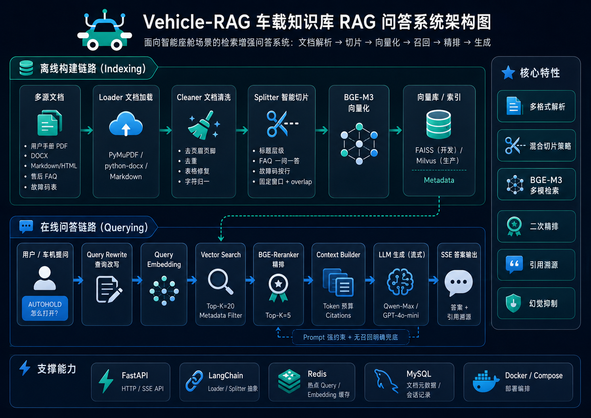

<p align="center">
  
</p>

<h1 align="center">Vehicle-RAG</h1>

<p align="center">
  Vehicle knowledge-base RAG service for manuals, trouble codes, and after-sales FAQ.
</p>

<p align="center">
  <a href="https://www.python.org/"></a>
  <a href="https://fastapi.tiangolo.com/"></a>
  
  
  
</p>

## Overview

Vehicle-RAG is a retrieval-augmented question answering system for intelligent cockpit and vehicle-service scenarios. It turns vehicle manuals, fault-code tables, policy documents, and FAQ content into searchable knowledge chunks, then answers user questions with grounded citations.

The default local setup is lightweight: deterministic hash embeddings, a JSON-backed vector index, and an extractive answer fallback. Production integrations such as BGE-M3, rerankers, Redis, MySQL, FAISS, and Milvus can be plugged in behind the existing module boundaries.

## Features

- Multi-format ingestion for PDF, DOCX, Markdown, TXT, and HTML.
- Document cleaning for repeated headers/footers, duplicated paragraphs, control characters, and simple table text repair.
- Adaptive chunking for manuals, FAQ, trouble-code tables, and policy-style documents.
- Local vector retrieval with metadata filters such as `vehicle_model`, `doc_type`, and `code`.
- Lightweight reranking with a replaceable BGE reranker wrapper.
- Synchronous and SSE streaming QA APIs.
- Citation mapping from generated answers back to source chunks.
- Docker and script entry points for local development.

## Architecture

<p align="center">
  
</p>

```text
Documents
   |
   v
Loader -> Cleaner -> Splitter -> Embedder -> Vector Store
                                               |
Question -> Query Rewrite -> Retrieval -> Rerank -> Context -> LLM -> Answer + Citations
```

Core modules:

```text
app/
├── api/          FastAPI routes
├── ingestion/    loaders, cleaners, splitters, pipeline
├── embedding/    local hash embedding and BGE-M3 wrapper
├── retrieval/    vector store abstraction, JSON store, reranker
├── qa/           RAG chain, context builder, citation mapping
├── llm/          extractive fallback and OpenAI-compatible client
├── models/       Pydantic data models
└── config/       environment settings
```

## Quick Start

### 1. Install

```bash
pip install -e ".[dev]"
```

### 2. Run the API

```bash
uvicorn app.main:app --reload --port 8001
```

Health check:

```bash
curl http://localhost:8001/health
```

### 3. Ingest Documents

Place source files under `data/raw`, then run:

```bash
python scripts/ingest_directory.py \
  --dir data/raw \
  --doc-type manual \
  --metadata "{\"vehicle_model\":\"L9\"}"
```

Supported `doc-type` values:

| Type | Best for | Chunking strategy |
| --- | --- | --- |
| `manual` | Vehicle manuals | Heading-aware chunks |
| `faq` | After-sales FAQ | Question/answer blocks |
| `trouble_code` | Fault-code tables | One row per chunk |
| `policy` | Long policy text | Fixed window with overlap |

### 4. Ask a Question

```bash
curl -X POST http://localhost:8001/v1/qa \
  -H "Content-Type: application/json" \
  -d "{\"question\":\"AUTOHOLD 怎么开\",\"filters\":{\"vehicle_model\":\"L9\"}}"
```

Streaming endpoint:

```bash
curl -N -X POST http://localhost:8001/v1/qa/stream \
  -H "Content-Type: application/json" \
  -d "{\"question\":\"P0301 是什么意思?\"}"
```

## API

| Method | Path | Description |
| --- | --- | --- |
| `GET` | `/health` | Service health check |
| `POST` | `/v1/ingest` | Upload and index one document |
| `POST` | `/v1/qa` | Return one grounded QA response |
| `POST` | `/v1/qa/stream` | Stream query, retrieval, token, and final events |
| `GET` | `/v1/knowledge/documents` | List indexed documents |
| `DELETE` | `/v1/knowledge/documents/{doc_id}` | Delete a document's chunks |

## Configuration

Copy the example environment file when you need custom settings:

```bash
cp .env.example .env
```

Common options:

| Variable | Default | Description |
| --- | --- | --- |
| `APP_PORT` | `8001` | API port |
| `INDEX_PATH` | `data/processed/vector_index.json` | Local vector index path |
| `EMBEDDING_DIM` | `384` | Hash embedding dimension |
| `RETRIEVAL_TOP_K` | `20` | Initial recall count |
| `RERANK_TOP_K` | `5` | Context candidate count |
| `LLM_BASE_URL` | empty | Optional OpenAI-compatible base URL |
| `LLM_API_KEY` | empty | Optional chat completion API key |
| `LLM_MODEL` | `qwen-max` | Chat completion model name |

## Development

Run tests:

```bash
python -m pytest
```

Compile-check Python modules:

```bash
python -m compileall app scripts
```

Rebuild the local index:

```bash
python scripts/rebuild_index.py \
  --clear \
  --dir data/raw \
  --doc-type manual \
  --metadata "{\"vehicle_model\":\"L9\"}"
```

Evaluate a JSONL question set:

```bash
python scripts/evaluate_rag.py --file data/eval/questions.jsonl
```

## Docker

```bash
docker compose -f docker/docker-compose.yml up --build
```

The default stack starts the API, Redis, and MySQL, exposes the API on `http://localhost:8001`, and mounts `data/` for local persistence.

Milvus is available as an optional profile:

```bash
docker compose -f docker/docker-compose.yml --profile milvus up --build
```

## Roadmap

- Hybrid retrieval with BM25 and vector RRF fusion.
- Persistent FAISS index implementation.
- Milvus backend with partition-aware metadata filtering.
- Redis-backed QA and embedding cache.
- Full provider streaming for OpenAI-compatible chat completions.
- Automated RAG evaluation reports.

## License

MIT
